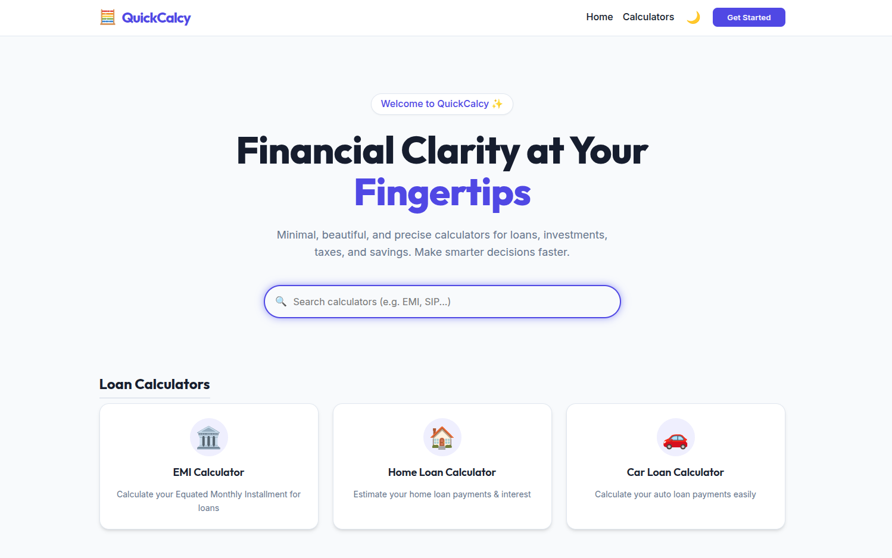

# QuickCalcy ✨
> **Minimal. Beautiful. Precise.**

[](https://angular.dev/)
[](https://opensource.org/licenses/MIT)
[](https://github.com/yourusername/quick-calcy)

QuickCalcy is a premium financial calculator suite designed for clarity and speed. Whether you're planning a home loan, tracking an investment, or calculating tax, QuickCalcy provides a seamless, distraction-free experience.



## 🚀 Key Features

- **12+ Financial Tools**: Comprehensive coverage for Loans, Investments, Taxes, Savings, and Utilities.
- **Smart Search**: Instant results with categorical hierarchy and smooth micro-interactions.
- **Dynamic Theming**: Full support for both light and dark modes.
- **Ultra-Responsive**: Mobile-first design with a functional hamburger menu and optimized layouts.
- **Privacy First**: No server-side storage; all calculations happen locally in your browser.

## 🏗️ Project Architecture

QuickCalcy follows a modular, clean-architecture approach within the Angular ecosystem to ensure scalability and ease of maintenance.

### 🧩 Core Concepts

- **Centralized Logic**: All 12 calculator definitions, metadata, and routing logic are managed by the `CalculatorService`. This allows for a single, dynamic "Calculator Page" that reconfigures itself based on the active tool.
- **Component Atomic Design**:
  - **Shared Components**: High-level UI primitives (`InputField`, `ResultCard`, `Navbar`) used across all tools.
  - **Feature Components**: Encapsulated mathematical logic for each specific calculator (e.g., `SipCalculatorComponent`).
- **Reactive State**: Uses Angular's modern `Signal` API for theme state and lightweight data binding.

### 📁 Directory Structure

```yml
src/
├── app/
│   ├── core/           # Singleton Services & Models
│   ├── features/       # Individual Calculator Logic (Loan, Tax, etc.)
│   ├── pages/          # High-level Views (Home, Generic Tool Page)
│   ├── shared/         # Reusable UI Components & Tokens
│   └── app.routes.ts   # Dynamic Parameterized Routing
├── assets/             # Brand assets & icons
└── styles.css          # Design System & Theming Tokens
```

### 🌓 Theming System
Theming is implemented using CSS Variables and a top-level `.dark` class toggle. This ensures zero-latency theme switching and minimizes style duplication.

---
## 🛠️ Installation & Setup

1. **Clone the repository**
   ```bash
   git clone https://github.com/yourusername/quick-calcy.git
   cd quick-calcy
   ```

2. **Install dependencies**
   ```bash
   npm install
   ```

3. **Start Development Server**
   ```bash
   npm start
   ```
   Visit `http://localhost:4200` to see the magic.

4. **Production Build**
   ```bash
   npm run build
   ```

---
Developed with precision by the QuickCalcy Team. 📈
